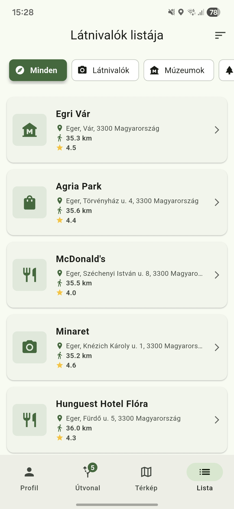
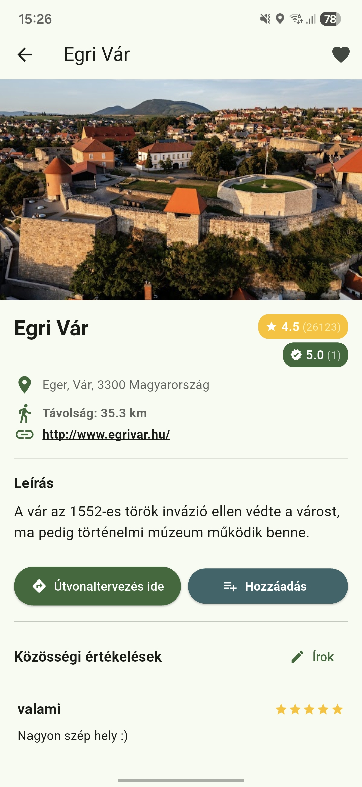
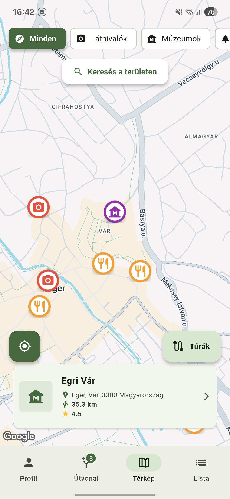

# Eger Maps App

This repo is for my thesis that I made during my studies at Eszterházy Károly Catholic University. This is a modern, cross-platform capable tourism mobile app, helping the discovery of the city of Eger.

## Main features
* **Map search and filters** Local points of interest, museums and restaurants from a dynamic category-based query.
* **Road planner** Personalized roadtrip composition and multi-point navigation via Google Maps
* **Community features** Ratings and public roadtrip submissions

  
  
  

## Useg technologies
* **Client:** Flutter (Dart)
* **Backend:** Firebase (Authentication, Firestore)
* **Map and data:** Google Maps API, Google Places API
* **Architecture:** MVVM, Provider for state management

## Run locally
To run the app locally you'Ll need your own API keys.
1. Clone the repo: `git clone https://github.com/MrSeal1/eger_terkep_app.git`
2. Install the packages: `flutter pub get`
3. Create a `.env` file in the project's root directory, and enter your Google API key: `MAPS_API_KEY=your-key`
4. Join your Firebase project by configuring `firebase_options.dart`
5. Start the app: `flutter run`

## Made by
**Fidrus Bence** *Computer Science BSc - 2026*
